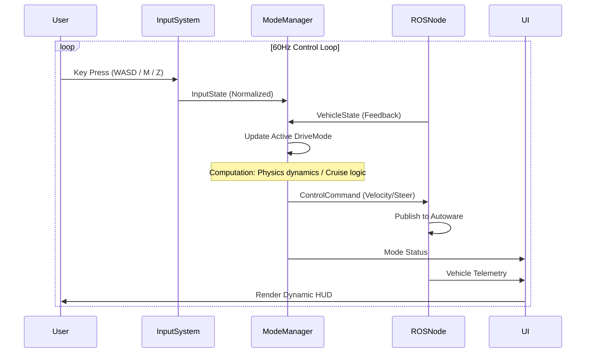
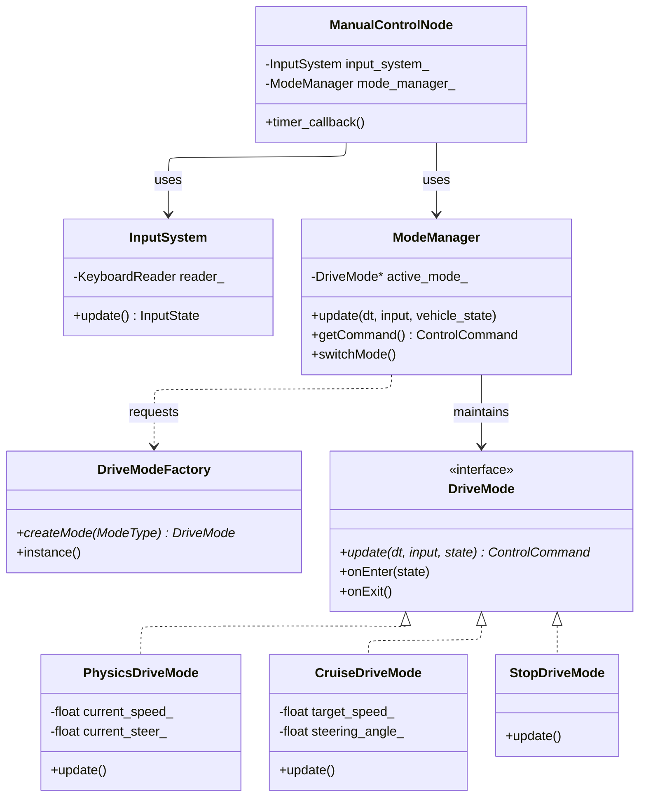

# Autoware Manual Controller

A robust, modular keyboard teleoperation node designed for Autoware.universe.
This project provides high-precision vehicle control, supporting physics-based inertial driving experiences and stable cruise control functionalities.

## 🌟 Key Features

### 1. Physics Mode - Default
Simulates realistic vehicle dynamics to provide a natural driving feel, similar to racing games.
*   **Inertia & Friction**: The vehicle coasts naturally when the throttle is released and slows down slowly due to friction.
*   **Dynamic Steering**: Steering angle has Attack/Decay rate limits to prevent abrupt inputs, simulating the turning speed of a real steering wheel.

### 2. Cruise Mode
Optimized for long-distance testing and maintaining constant curvature.
*   **Smart Grid Snapping**: Tapping `W` or `S` increases/decreases speed by exactly `1.0 km/h` (snapping to the nearest integer), facilitating precise test conditions.
*   **Steering Lock**: Unlike Physics mode, the steering angle **does not auto-center** when keys are released. This allows you to set a fixed turning radius for hands-free circular or long-curve testing.
*   **Hold Logic**: Holding the keys provides smooth, continuous acceleration/deceleration.

### 3. Dynamic HUD
The console output has been redesigned into a flicker-free HUD interface.
*   **Standard Telemetry**: Displays Gear, Real Speed vs Target Speed, and Steering Angle (rad).
*   **Context Awareness**:
    *   **Physics Mode**: Displays real-time *Acceleration* (`m/s^2`) to monitor inertial state.
    *   **Cruise Mode**: Highlights the *Set Speed*.

### 4. Robust Safety & Integration
*   **Stop-Wait-Shift Logic**: Implements a strict state machine preventing gear shifts while moving. The vehicle automatically brakes to a complete stop (`< 0.05 m/s`) before engaging Drive or Reverse, eliminating dangerous acceleration spikes.
*   **Gear Transition UI**: Visualizes the shifting process (e.g., `Gear: D->R`) in the HUD, providing clear feedback during the safety wait period.
*   **Auto-Reengage**: Automatically attempts to re-engage control if the signal is lost while in `External` mode.
*   **Initial Pose Presets**: Cycle through predefined initial pose estimates (e.g., `origin`, `checkpoint_A`) using the `R` key.

## 🎮 Controls

### Global Keys
| Key       | Function             | Description                                                     |
| :-------- | :------------------- | :-------------------------------------------------------------- |
| **Z**     | Toggle Auto/External | Switches `GateMode`. Must be in `External` mode to control.     |
| **M**     | Switch Mode          | Cycles between `Physics` -> `Cruise` -> `Stop` modes.           |
| **R**     | Reset Pose           | Cycles through initial pose presets (defined in `param`).       |
| **Space** | Emergency Stop       | Force stop with max braking (-10 m/s^2). Press again to resume. |
| **Q**     | Quit                 | Exits the node.                                                 |

### Gear Selection
*   **X**: Drive (D)
*   **C**: Reverse (R)
*   **V**: Park (P)

### Driving Controls
| Key       | Physics Mode Action             | Cruise Mode Action                           |
| :-------- | :------------------------------ | :------------------------------------------- |
| **W**     | Throttle (Linear Accel)         | **Tap**: +1 km/h <br> **Hold**: Smooth Accel |
| **S**     | Brake (Linear Decel)            | **Tap**: -1 km/h <br> **Hold**: Smooth Decel |
| **A / D** | Steer Left/Right (Auto-centers) | Steer Left/Right (**Angle Lock**)            |

## 🏗️ Architecture

This project has transitioned from a simple script to a professional **Component-Based Architecture**.

### Directory Structure
```bash
src/
├── core/       # Core Logic (ModeManager, Factory, Interfaces)
├── modes/      # Concrete Drive Mode Implementations (Physics, Cruise, Stop)
├── input/      # Input Handling (KeyboardReader, InputSystem)
├── ui/         # User Interface (ConsoleUI)
└── common/     # Shared Types and Constants
```

### Data Flow



### Class Structure
We utilize a **Strategy Pattern** combined with a **Factory** to manage driving modes, allowing for runtime mode switching and easy extension of new control logic.



---

## 🛠️ Build & Run

A highlight of this project is the standardization of the **Containerized Verification Workflow**. Through well-encapsulated scripts, developers can verify logic and test without installing a complex Autoware / ROS 2 environment on the Host.

### Build (Normal ROS2)

#### Prerequisites
*   OS: Ubuntu 22.04 / 24.04
*   ROS 2: Humble

```bash
mkdir -p autoware_manual_control_ws/src
cd autoware_manual_control_ws/src
git clone https://github.com/evshary/autoware_manual_control.git
cd ..
colcon build
```

### Build and Testing (Docker) - Recommended

We provide a simplified Docker setup that communicates with Autoware via the Host Network using DDS.

#### Prerequisites
*   Docker & Docker Compose

#### 1. Start Containers

```bash
git clone https://github.com/evshary/autoware_manual_control.git
cd autoware_manual_control

# Start containers
./run_containers.sh up --build -d
```

#### 2. Enter Control Node
We provide a convenient script `run_teleop.sh` that automatically performs the following:
1. Connects to the running container.
2. Sources environment variables.
3. Automatically builds the latest code.
4. Starts the `manual_control` node.

```bash
./run_teleop.sh
```

#### 3. Stop Services
```bash
./run_containers.sh down
```
