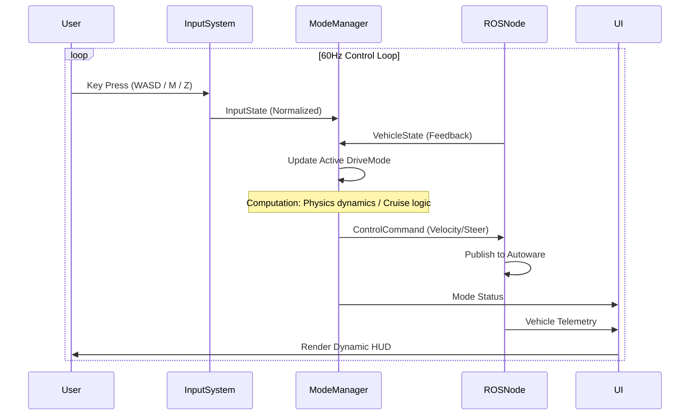
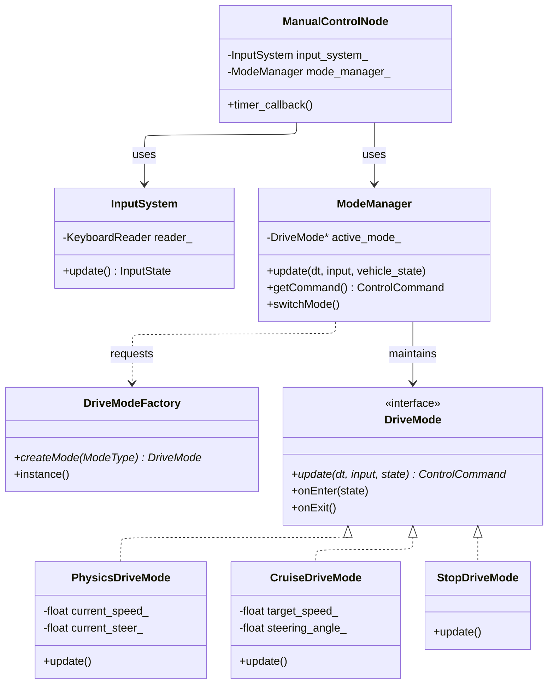

# Autoware Manual Controller

A robust, modular keyboard teleoperation node designed for Autoware.universe.
This project provides high-precision vehicle control, supporting physics-based inertial driving experiences and stable cruise control functionalities.

## 🚀 Quick Start (Release Container)

The fastest way to run the controller without building from source.

### 0. Prerequisites
The Autoware container (started via compose) requires a map volume. Run this **once** to populate it:
```bash
docker run --rm -v autoware_map:/map \
  ghcr.io/autowarefoundation/autoware-tools:scenario-simulator \
  cp -r /opt/autoware/share/kashiwanoha_map/map/. /map/
```

### Method 1: Docker Compose (Recommended)
```bash
# 1. Start Services (Autoware + Teleop Node)
docker compose -f docker-compose-release.yaml up -d

# 2. Attach & Control
./run_teleop.sh
```

### Method 2: Docker Standalone
Since the release container idles by default (to prevent node conflicts), you must verify the run command:

```bash
# Basic Run
docker run --rm -it --net=host \
  ghcr.io/evshary/autoware_manual_control:feat-ci-image-release \
  ros2 run autoware_manual_control keyboard_control

# With Custom Config
docker run --rm -it --net=host \
  -v $(pwd)/teleop_config.yaml:/autoware_manual_control_ws/teleop_config.yaml \
  ghcr.io/evshary/autoware_manual_control:feat-ci-image-release \
  ros2 run autoware_manual_control keyboard_control --ros-args --params-file teleop_config.yaml
```

---

## 🕹️ Operation Guide

### 1. Driving Checklist
Follow this sequence to specific start driving:

1.  **Set Initial Pose**: Press `R` to cycle through preset locations (e.g., origin) to initialize the vehicle on the map.
2.  **Engage External Mode**: Press `Z` to switch `GateMode` to `External`.
3.  **Shift Gear**: Press `X` for Drive (D) or `C` for Reverse (R).
4.  **Select Drive Mode**: Press `M` to switch from the default `Stop` mode to `Physics` or `Cruise` mode.
5.  **Drive**: Use `WASD` to control the vehicle.

### 2. Controls
| Key       | Function             | Description                                                     |
| :-------- | :------------------- | :-------------------------------------------------------------- |
| **Z**     | Toggle Auto/External | Switches `GateMode`. Must be in `External` mode to control.     |
| **M**     | Switch Mode          | Cycles between `Physics` -> `Cruise` -> `Stop` modes.           |
| **R**     | Reset Pose           | Cycles through initial pose presets (defined in `param`).       |
| **Space** | Emergency Stop       | Force stop with max braking (-10 m/s^2). Press again to resume. |
| **Q**     | Quit                 | Exits the node.                                                 |

#### Gear Selection
*   **X**: Drive (D)
*   **C**: Reverse (R)
*   **V**: Park (P)

#### Driving Controls
| Key       | Physics Mode Action             | Cruise Mode Action                           |
| :-------- | :------------------------------ | :------------------------------------------- |
| **W**     | Throttle (Linear Accel)         | **Tap**: +1 km/h <br> **Hold**: Smooth Accel |
| **S**     | Brake (Linear Decel)            | **Tap**: -1 km/h <br> **Hold**: Smooth Decel |
| **A / D** | Steer Left/Right (Auto-centers) | Steer Left/Right (**Angle Lock**)            |

### 3. Driving Modes
*   **Physics Mode**: Simulates realistic inertia & friction. Steering has attack/decay limits.
*   **Cruise Mode**: optimized for testing. `W`/`S` snaps speed by 1.0 km/h. Steering does not auto-center (Angle Lock).
*   **Stop Mode**: Safety default. Max braking.

---

## ⚙️ Configuration
The node behavior can be customized via `teleop_config.yaml`.

### Auto-Engagement
```yaml
/ManualControl:
  ros__parameters:
    start_as_external: true  # If true, automatically switches to External mode and engages on startup
```
*   **start_as_external**: Set to `true` to skip the manual `Z` toggle and immediately take control. Useful for headless setups.
*   **init_pose**: Define preset locations for the `R` (Reset Pose) key.

---

## 🛠️ Development Setup

For developers who want to modify source code or debug.

### Prerequisites
*   Docker & Docker Compose (Recommended) OR ROS 2 Humble

### 1. Build and Run (Docker)
We provide a simplified Docker setup that communicates with Autoware via the Host Network.

```bash
# 1. Start Dev Containers
./run_containers.sh up --build -d

# 2. Enter Control Node (Auto-builds & Runs)
./run_teleop.sh
```

### 2. Build (Native ROS 2)
```bash
mkdir -p autoware_manual_control_ws/src
cd autoware_manual_control_ws/src
git clone https://github.com/evshary/autoware_manual_control.git
cd ..
colcon build
```

---

## 🏗️ Architecture

This project has transitioned from a simple script to a professional **Component-Based Architecture**.

### Directory Structure
```bash
src/
├── core/       # Core Logic (ModeManager, Factory, Interfaces)
├── modes/      # Concrete Drive Mode Implementations (Physics, Cruise, Stop)
├── input/      # Input Handling (KeyboardReader, InputSystem)
├── ui/         # User Interface (ConsoleUI)
└── common/     # Shared Types and Constants
```

### Data Flow



### Class Structure
We utilize a **Strategy Pattern** combined with a **Factory** to manage driving modes, allowing for runtime mode switching and easy extension of new control logic.



### How to add a new Drive Mode
1.  **Inherit**: Create a new class inheriting from `DriveMode` (see `src/core/drive_mode.hpp`).
2.  **Implement**: Implement `update()`, `onEnter()`, `onExit()`.
3.  **Register**: In `keyboard_control.cpp` (or `main`), register the mode with the factory.
4.  **Enumerate**: Add your new `ModeType` enum in `src/common/types.hpp`.

### CI/CD Pipeline
*   **Triggers**: Push to `main` or Tag `v*` -> Builds & Pushes to GHCR.
*   **Image**: `ghcr.io/evshary/autoware_manual_control:latest`

---

## ❓ Troubleshooting

### Global Status Error (Missing Map)
If you encounter a "Global Status Error" in RViz or TF errors related to the map frame (`map` frame does not exist), it is likely that the `autoware_map` volume is empty.

👉 **Solution**: Run the map setup command in the **Quick Start** section.

