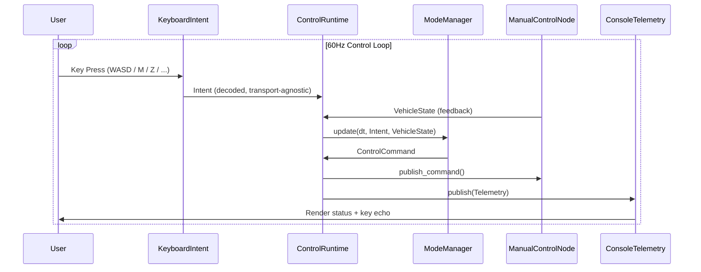
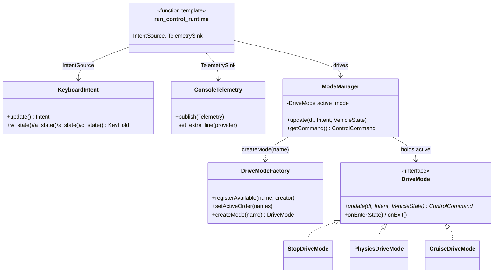

# Autoware Manual Controller

A robust, modular keyboard teleoperation node designed for Autoware.universe.
This project provides high-precision vehicle control, supporting physics-based inertial driving experiences and stable cruise control functionalities.

🎥 **[Watch the Demo Video](https://www.youtube.com/watch?v=Pyi3uyONG8A)**

## 🚀 Quick Start (Release Container)

The fastest way to run the controller without building from source.

### 0. Prerequisites
The Autoware container (started via compose) requires a map volume. Run this **once** to populate it:
```bash
docker run --rm -v autoware_map:/map \
  ghcr.io/autowarefoundation/autoware-tools:scenario-simulator \
  cp -r /opt/autoware/share/kashiwanoha_map/map/. /map/
```

### Method 1: Docker Compose (Recommended)
```bash
# 1. Start Services (Autoware + Teleop Node)
docker compose -f docker-compose-release.yaml up -d

# 2. Attach & Control
./run_teleop.sh
```

### Method 2: Docker Standalone
Since the release container idles by default (to prevent node conflicts), you must verify the run command:

```bash
# Basic Run
docker run --rm -it --net=host \
  "${TELEOP_IMAGE:-ghcr.io/evshary/autoware_manual_control:latest}" \
  ros2 run autoware_manual_control keyboard_control

# With Custom Config
docker run --rm -it --net=host \
  -v $(pwd)/teleop_config.yaml:/autoware_manual_control_ws/teleop_config.yaml \
  "${TELEOP_IMAGE:-ghcr.io/evshary/autoware_manual_control:latest}" \
  ros2 run autoware_manual_control keyboard_control --ros-args --params-file teleop_config.yaml
```

`TELEOP_IMAGE` can be overridden to point at a fork's CI build (e.g.
`TELEOP_IMAGE=ghcr.io/<your-fork>/autoware_manual_control:<tag>`).

## 🕹️ Operation Guide

### 1. Driving Checklist
Follow this sequence to start driving:

1.  **Configure** (optional): pick how this operator commands the vehicle with `operator_mode` (`local` or `remote`) and tune modes in `teleop_config.yaml` (see [Configuration](#️-configuration)).
2.  **Set Initial Pose**: Press `R` to cycle through the preset locations and initialize the vehicle on the map.
3.  **Engage**: Press `Z` to switch from `STOP` to your configured drive mode. Entering the drive mode **self-engages** (via the AD-API `enable_autoware_control`) — there is no separate engage step.
4.  **Shift Gear**: Press `X` for Drive (D) or `C` for Reverse (R).
5.  **Select Drive Mode**: Press `M` to cycle the active drive modes (the `modes:` list) — e.g. from `Physics` to `Cruise`.
6.  **Drive**: Use `WASD` to control the vehicle.

### 2. Controls
| Key       | Function          | Description                                                          |
| :-------- | :---------------- | :------------------------------------------------------------------- |
| **Z**     | Toggle Drive      | Switches between `STOP` and the configured drive mode; self-engages on entry. |
| **M**     | Switch Mode       | Cycles the active drive modes (the config `modes:` list).           |
| **R**     | Reset Pose        | Cycles through the initial-pose presets (`init_pose.presets`).      |
| **Space** | Emergency Stop    | Force stop with max braking. Press again to resume.                 |
| **Q**     | Quit              | Exits the node.                                                     |

#### Gear Selection
*   **X**: Drive (D)
*   **C**: Reverse (R)
*   **V**: Park (P)

#### Driving Controls
| Key       | Physics Mode Action             | Cruise Mode Action                           |
| :-------- | :------------------------------ | :------------------------------------------- |
| **W**     | Throttle (Linear Accel)         | **Tap**: +1 km/h <br> **Hold**: Smooth Accel |
| **S**     | Brake (Linear Decel)            | **Tap**: -1 km/h <br> **Hold**: Smooth Decel |
| **A / D** | Steer Left/Right (Auto-centers) | Steer Left/Right (**Angle Lock**)            |

The status line shows the live operation mode, gear, real/target speed and steer. A `Keys: [....]` line echoes your WASD input (UPPERCASE = held, lowercase = tapped, `.` = idle).

### 3. Driving Modes
Modes are config-selected plugins; the active set and cycle order come from the `modes:` list (which must include `stop`). The shipped modes are:

*   **Physics Mode**: Simulates realistic inertia & friction. Steering has attack/decay limits and auto-centers on release.
*   **Cruise Mode**: Optimized for testing. `W`/`S` snap the target speed by 1 km/h (tap) or ramp it (hold). Steering does not auto-center (Angle Lock).
*   **Stop Mode**: The required initial and emergency-stop mode. Commands max braking.

All per-mode tuning lives in the config (see below).

## ⚙️ Configuration

Behavior is customized via `teleop_config.yaml`; a fully-commented template ships as [`teleop_config.example.yaml`](teleop_config.example.yaml). Key parameters:

| Parameter | Meaning |
| :-------- | :------ |
| `operator_mode` | The AD-API operation mode this operator commands: `local` or `remote`. |
| `modes` | The active drive modes, in `M`-cycle order. Must include `stop`; an empty list, a missing `stop`, or an unknown name aborts startup with an explanatory error. |
| `control_rate_hz`, `shift_stop_tolerance`, `shift_brake_accel` | Shared control-loop settings (loop rate, and the stop-wait-shift gear-change behavior). |
| `physics:` / `cruise:` / `stop:` | Per-mode tuning blocks (speeds, accel/brake limits, steering rates, ...). Each mode reads its own block. |
| `init_pose.presets` | Named poses (`[x, y, z, yaw]`) cycled by the `R` key. |

```yaml
/ManualControl:
  ros__parameters:
    operator_mode: remote          # or "local"
    modes: ["stop", "physics", "cruise"]
    control_rate_hz: 60.0
    physics:
      max_speed: 27.78
      # ... see teleop_config.example.yaml for the full set
```

## 🛠️ Development Setup

For developers who want to modify source code or debug.

### Prerequisites
*   Docker & Docker Compose (Recommended) OR ROS 2 Humble

### 1. Build and Run (Docker)
We provide a simplified Docker setup that communicates with Autoware via the Host Network.

```bash
# 1. Start Dev Containers
./run_containers.sh up --build -d

# 2. Enter Control Node (Auto-builds & Runs)
./run_teleop.sh
```

### 2. Build (Keyboard Control Mode)

#### Compilation

```bash
mkdir -p autoware_manual_control_ws/src
cd autoware_manual_control_ws/src
git clone https://github.com/evshary/autoware_manual_control.git
cd ..
colcon build
```

#### Run the Node

```bash
ros2 run autoware_manual_control keyboard_control
```

### 3. Build with Zenoh (Remote Driving)

To enable the network transport (`zenoh_control`) for remote driving over Zenoh, you need the Zenoh C++ SDK and a JSON parser library.

#### Prerequisites & Dependencies

- **nlohmann_json**: A C++ JSON parser library. It can be installed via:
  ```bash
  sudo apt-get install nlohmann-json3-dev
  ```
- **Zenoh C/C++ SDK** (`zenohc` and `zenohcxx`):
  - **Option A (Recommended, via apt)**: On Ubuntu, set up the official Eclipse Zenoh apt repository first, then install the pre-built libraries (see [zenoh-cpp-example](https://github.com/evshary/zenoh-cpp-example#option-1-install-packages-via-apt-ubuntu) or official documentation):
    ```bash
    # Add the Zenoh GPG Key
    curl -L https://download.eclipse.org/zenoh/debian-repo/zenoh-public-key | sudo gpg --dearmor --yes --output /etc/apt/keyrings/zenoh-public-key.gpg
    # Add the Repository to Sources
    echo "deb [signed-by=/etc/apt/keyrings/zenoh-public-key.gpg] https://download.eclipse.org/zenoh/debian-repo/ /" | sudo tee /etc/apt/sources.list.d/zenoh.list > /dev/null
    # Update and Install
    sudo apt update
    sudo apt install libzenohcpp-dev libzenohc-dev
    ```
    Install a Zenoh 1.x release matching the `rmw_zenoh` / remote peer you connect to, otherwise the endpoints won't discover each other.
  - **Option B (Via rmw_zenoh workspace)**: If you build from a workspace that uses `rmw_zenoh`, the Zenoh vendor files are already bundled. You can export the path to this vendor prefix:
    ```bash
    export ZENOH_VENDOR_PREFIX="/path/to/rmw_zenoh_ws/install/zenoh_cpp_vendor/opt/zenoh_cpp_vendor"
    export LD_LIBRARY_PATH="${ZENOH_VENDOR_PREFIX}/lib:${LD_LIBRARY_PATH:-}"
    ```

#### Compilation

Build the package with the `TELEOP_WITH_ZENOH` CMake flag:

```bash
mkdir -p autoware_manual_control_ws/src
cd autoware_manual_control_ws/src
git clone https://github.com/evshary/autoware_manual_control.git
cd ..
# Build Zenoh transport only
colcon build --cmake-args -DTELEOP_WITH_KEYBOARD=OFF -DTELEOP_WITH_ZENOH=ON
```

#### Run the Node

```bash
ros2 run autoware_manual_control zenoh_control --ros-args --params-file teleop_config.yaml
```

#### Remote interface

`zenoh_control` has no local keyboard — it is driven by a remote operator client over Zenoh. It subscribes operator intent on `manual_control/<scope>/intent` and publishes vehicle telemetry on `manual_control/<scope>/telemetry`; both payloads are JSON.

Intent (client → node), one object per control tick:

| Field | Type | Meaning |
| :-- | :-- | :-- |
| `throttle` / `brake` / `steer` | number | drive axes (the keyboard's `W` / `S` / `A`·`D`) |
| `gear` | string | `PARK`, `DRIVE`, or `REVERSE` |
| `mode_cycle` / `toggle_auto` / `reset_pose` | integer | monotonic counters — increment to trigger the `M` / `Z` / `R` actions (drop/duplicate-safe) |
| `estop` | integer | non-zero = emergency stop |

Telemetry (node → client), published every control tick:

| Field | Meaning |
| :-- | :-- |
| `operation_mode` / `mode` / `mode_status` | AD-API operation mode, active drive mode, mode status text |
| `velocity` / `steer_angle` / `gear` | live vehicle state |
| `target_velocity` / `target_acceleration` / `target_steer` | the command being sent |
| `shift_state` / `pending_gear` | gear-shift progress |
| `info` | human-readable status / last error |
| `timestamp` | publish time (ms) |

## 🏗️ Architecture

A small, component-based design. The control loop is generic over two ports — an **intent source** (produces operator `Intent`) and a **telemetry sink** (consumes vehicle `Telemetry`) — so a transport can be swapped without touching the control or mode logic.

### Directory Structure
```bash
src/
├── common/      # Shared data: domain atoms (types.hpp) + the two port payloads (intent.hpp, telemetry.hpp)
├── core/        # Control machinery: 60Hz loop (control_runtime), ModeManager, DriveMode interface + factory,
│                #   the mode registry (register_modes), and generic ROS-param helpers (param_utils)
├── modes/       # Drive-mode strategies (stop, physics, cruise)
├── ros/         # ROS boundary: ManualControlNode (pubs/subs/services, AD-API operation mode)
├── io/
│   ├── intent/      # Input adapters  — KeyboardIntent: keys -> Intent (sole stdin reader)
│   └── telemetry/   # Output adapters — ConsoleTelemetry: Telemetry -> terminal (sole stdout writer)
└── keyboard_control.cpp   # Composition root (main): wires the adapters + modes into the loop
```

### Data Flow


```mermaid
sequenceDiagram
    participant User
    participant KeyboardIntent
    participant ControlRuntime
    participant ModeManager
    participant ManualControlNode
    participant ConsoleTelemetry

    loop 60Hz Control Loop
        User->>KeyboardIntent: Key Press (WASD / M / Z / ...)
        KeyboardIntent->>ControlRuntime: Intent (decoded, transport-agnostic)
        ManualControlNode->>ControlRuntime: VehicleState (feedback)
        ControlRuntime->>ModeManager: update(dt, Intent, VehicleState)
        ModeManager->>ControlRuntime: ControlCommand
        ControlRuntime->>ManualControlNode: publish_command()
        ControlRuntime->>ConsoleTelemetry: publish(Telemetry)
        ConsoleTelemetry->>User: Render status + key echo
    end
```

### Class Structure
A **Strategy Pattern** + **Factory** manage driving modes, allowing runtime switching and easy extension. The 60Hz loop `run_control_runtime` is templated on the two ports.


```mermaid
classDiagram
    class run_control_runtime {
        <<function template>>
        IntentSource, TelemetrySink
    }
    class KeyboardIntent {
        +update() Intent
        +w_state()/a_state()/s_state()/d_state() KeyHold
    }
    class ConsoleTelemetry {
        +publish(Telemetry)
        +set_extra_line(provider)
    }
    class ModeManager {
        -DriveMode active_mode_
        +update(dt, Intent, VehicleState)
        +getCommand() ControlCommand
    }
    class DriveModeFactory {
        +registerAvailable(name, creator)
        +setActiveOrder(names)
        +createMode(name) DriveMode
    }
    class DriveMode {
        <<interface>>
        +update(dt, Intent, VehicleState)* ControlCommand
        +onEnter(state) / onExit()
    }
    class StopDriveMode
    class PhysicsDriveMode
    class CruiseDriveMode

    run_control_runtime --> KeyboardIntent : IntentSource
    run_control_runtime --> ConsoleTelemetry : TelemetrySink
    run_control_runtime --> ModeManager : drives
    ModeManager ..> DriveModeFactory : createMode(name)
    ModeManager --> DriveMode : holds active
    DriveMode <|.. StopDriveMode
    DriveMode <|.. PhysicsDriveMode
    DriveMode <|.. CruiseDriveMode
```

### How to add a new Drive Mode
The smallest worked example is [`src/modes/stop_mode.hpp`](src/modes/stop_mode.hpp) (~40 lines) — read it first; it shows the whole contract. To add a mode:

1.  **Implement** `src/modes/<name>_mode.hpp`: a class inheriting `DriveMode` (`src/core/drive_mode.hpp`) that provides
    *   `static constexpr const char *kName = "<name>";`
    *   a `struct Params { ... };` plus `static Params loadParams(rclcpp::Node &node)` that reads its tuning from config (use the `load_param` / `load_float` / `load_double` helpers in `core/param_utils.hpp`),
    *   a constructor taking `const Params &`, and the strategy method `ControlCommand update(float dt, const Intent &intent, const VehicleState &vehicle_state)` (optionally `onEnter` / `onExit` / `getStatusString`).
2.  **Register** it: add one line `register_mode<YourDriveMode>(factory, node);` to `register_all_modes` in `src/core/register_modes.hpp`.
3.  **Enable** it: add its `kName` to the `modes:` list in `teleop_config.yaml` (and a tuning block if it has params).

That is the whole change — one mode file, one register line, one config entry. No enum, no factory edits, no loop changes.

### CI/CD Pipeline
*   **Triggers**: Push to `main` or Tag `v*` -> Builds & Pushes to GHCR.
*   **Image**: `ghcr.io/evshary/autoware_manual_control:latest`

## ❓ Troubleshooting

### Global Status Error (Missing Map)
If you encounter a "Global Status Error" in RViz or TF errors related to the map frame (`map` frame does not exist), it is likely that the `autoware_map` volume is empty.

👉 **Solution**: Run the map setup command in the **Quick Start** section.

## Maintainers

| Avatar | GitHub ID | Name |
| --- | --- | --- |
| <a href="https://github.com/evshary"></a> | [@evshary](https://github.com/evshary) | ChenYing Kuo |
| <a href="https://github.com/Shiritai"></a> | [@Shiritai](https://github.com/Shiritai) | Tzu-Ching Yang |
