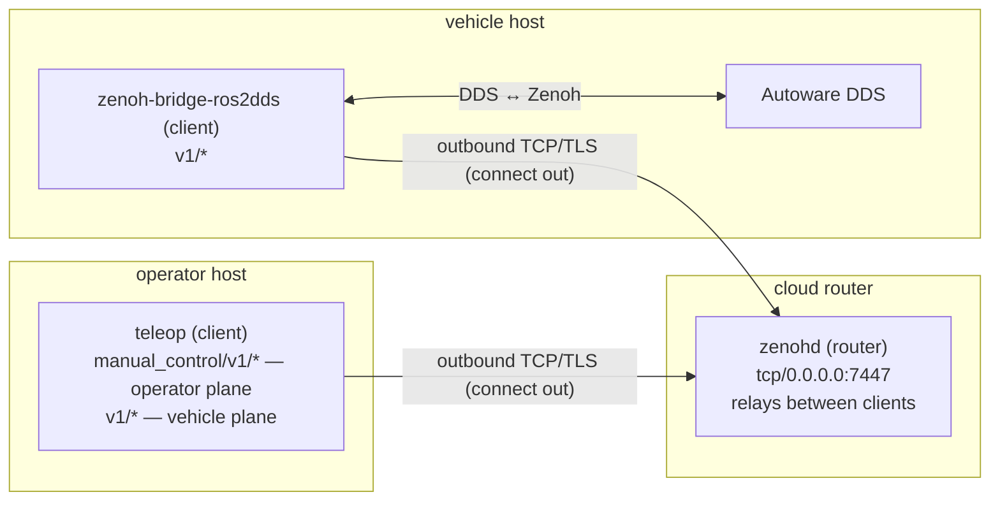

# Cross-Machine Remote Driving

This chapter drives an Autoware vehicle from a second machine over Zenoh, with **no ROS on the operator side** and no shared DDS domain — or even LAN — between the two. The shipped `run_containers.sh --operator` host runs `keyboard_control` on the `native_zenoh` transport (the [matrix](introduction.md#the-matrix)'s *local terminal, no ROS* cell): the operator's keystrokes and console stay local, and only the *Autoware transport* crosses the network, as Zenoh. Swapping in `zenoh_control` lifts the operator I/O onto Zenoh too — a remote UI — over the identical network path. The chapter builds that link up from a same-host proof to a real path over the Internet.

## The scope and the two key families

Every key is prefixed by `<scope>` (the `scope` parameter, default `v1`), which the operator client and the vehicle bridge must agree on. Two kinds of key cross the wire:

- **Operator I/O** — `zenoh_control` exchanges JSON `Intent`/`Telemetry` on `manual_control/<scope>/intent` and `manual_control/<scope>/telemetry`.
- **Autoware transport** — the `native_zenoh` `AutowareGateway` exchanges DDS-CDR Autoware messages on `<scope>/…` keys (`v1/vehicle/status/velocity_status`, `v1/external/selected/control_cmd`, `v1/api/operation_mode/state`, and so on).

Both sessions read the same `zenoh_config` parameter, so they join the same Zenoh network through the same endpoint.

## The operator host: a minimal, ROS-free teleop

Because the `native_zenoh` node needs no ROS at runtime, the operator does not run the full stack. `run_containers.sh --operator` starts **only** the teleop, from a minimal image (`Dockerfile.operator`) that builds `keyboard_control` on the `native_zenoh` transport and ships it on a plain Ubuntu base — the sole runtime library is `libzenohc`; there is no ROS, no message package, and no Autoware. It reaches a remote vehicle over Zenoh — dialing out (`ZENOH_CONNECT`) or, when it is the reachable side, listening (`ZENOH_LISTEN`) — and drives; the operator's keystrokes and the console UI stay local, and only the scoped keys traverse the network.

```bash
ZENOH_CONNECT=tcp/<remote>:7447 ./run_containers.sh --operator up
./run_teleop.sh
```

`--operator` implies `--transport zenoh` and starts nothing else (no Autoware, no bridge, no visualizer — those live on the vehicle side). `run_teleop.sh` detects the operator container, **generates** the Zenoh client config from `ZENOH_CONNECT` / `ZENOH_LISTEN` / `ZENOH_MODE` (below), and runs the prebuilt binary — no rebuild.

## The DDS↔Zenoh bridge

Autoware itself still speaks DDS. To put its topics on Zenoh, a [`zenoh-bridge-ros2dds`](https://github.com/eclipse-zenoh/zenoh-plugin-ros2dds) runs *next to* Autoware, sharing its DDS domain, and serves Zenoh on TCP. The shipped compose stack runs `eclipse/zenoh-bridge-ros2dds:1.9.0` with `network_mode: host`, launched as `-n /v1 -c /config/zenoh-bridge.json5 -l tcp/0.0.0.0:7447` so every bridged key is prefixed with the `/v1` scope and the bridge listens on 7447. `config/zenoh-bridge.json5` is deliberately minimal: `mode: "peer"`, an empty `listen` (supplied by the launch command instead, so a connect-only bridge can simply drop it), and an **allow-list** under `plugins.ros2dds.allow` that is exactly the topics and services the node touches — nothing else crosses the bridge. On the wire it exposes `v1/vehicle/status/...` etc., which is exactly what the gateway's scope-prefixed keys address.

For the NAT case (below) the bridge instead dials **out** to a router. `run_containers.sh` injects that: with `ZENOH_CONNECT` set it launches the bridge with `-e <endpoint>` and no `-l` (so it never contends for the port), and appends the `ZENOH_MODE` positional when that is set — `client` for a router, the peer default otherwise.

## No discovery: one explicit endpoint

`config/zenoh-client.example.json5` is a **reference** for the operator's Zenoh client — the script generates an equivalent, it does not read this file:

```json5
{
  mode: "peer",   // direct to a vehicle bridge; "client" via a middle router
  connect: { endpoints: ["tcp/host.docker.internal:7447"] },
  scouting: { multicast: { enabled: false }, gossip: { enabled: false } }
}
```

This is the key to driving across networks: there is **no discovery**. Multicast and gossip scouting are both off, and the session connects to one explicit TCP endpoint. The operator and the vehicle find each other purely by address — nothing depends on shared broadcast domains, mDNS, or a shared DDS domain. `run_teleop.sh` **generates** this config from `ZENOH_MODE` / `ZENOH_CONNECT` / `ZENOH_LISTEN` (not from the example file above), so pointing the operator at an arbitrary address — or making it the listening server — is a one-variable change.

## `--isolated`: the local proof

`run_containers.sh --isolated` demonstrates the network crossing on a single machine. It places the teleop container on its own Docker bridge network (`network_mode: bridge`, with `extra_hosts: host.docker.internal:host-gateway`) and keeps the client's `scouting`-off block, so the container has **no** DDS visibility, no multicast, and no gossip — it can reach the DDS↔Zenoh bridge **only** over `tcp/host.docker.internal:7447`. That a node so isolated still drives a full Autoware vehicle, over one TCP connection, is the proof of the model.

Its limit is in the endpoint: `host.docker.internal` resolves to the *same host*. `--isolated` proves Zenoh crosses a network boundary; it does not by itself cross the Internet. The next sections replace that endpoint with a routable one, in one of two topologies.

## Topology 1 — direct: one side has a reachable address

When one side can reach the other by address — same LAN, a public IP, or a shared VPN — no middle component is needed: one side is the fixed-IP **server** (`ZENOH_LISTEN`), the other **dials** it (`ZENOH_CONNECT`), and both stay peers (`ZENOH_MODE=peer`, the default). Either side can take either role — whichever has the reachable address is the server.

The vehicle bridge listens by default, so the common case is the operator dialing the vehicle:

```bash
# Vehicle host: Autoware + bridge (bridge listens on 7447)
./run_containers.sh up --transport zenoh

# Operator host: dial the vehicle's address
ZENOH_CONNECT=tcp/<vehicle-ip>:7447 ./run_containers.sh --operator up
./run_teleop.sh
```

If instead the **operator** is the one with the reachable address — a control centre the vehicles dial into — flip it: the operator listens and the vehicle bridge dials out.

```bash
# Operator host: be the server (publishes the listen port)
ZENOH_LISTEN=tcp/0.0.0.0:7447 ./run_containers.sh --operator up
./run_teleop.sh

# Vehicle host: dial the operator
ZENOH_CONNECT=tcp/<operator-ip>:7447 ./run_containers.sh up --transport zenoh
```

A mesh VPN — [Tailscale](https://tailscale.com/), plain [WireGuard](https://www.wireguard.com/) — is the simplest way to make a NAT'd side reachable: it gives each host a stable private address and carries both the traversal and the encryption, so the dial address is just the VPN address. This is often the quickest route to a secure link; the trade-off is running the VPN on both ends.

## Topology 2 — cloud router: NAT on both ends

When neither end has a reachable address, put a Zenoh router (`zenohd`) on a host both can reach — typically a small public VM — and have the operator **and** the vehicle each `connect` **out** to it. Both connections are outbound, so neither side needs a public IP or an inbound port; the router is the only publicly reachable component, which is what solves NAT.

The router relays only between **clients**, not between two peers — so both ends join as clients: set `ZENOH_MODE=client` on the vehicle side (it becomes the injected bridge command's mode positional) and on the operator side alike.



**1. Router host** — any host both machines can reach. The `eclipse/zenoh` image runs `zenohd` in router mode:

```bash
docker run --rm -p 7447:7447 eclipse/zenoh:1.9.0 -l tcp/0.0.0.0:7447
```

**2. Vehicle host** — Autoware plus the bridge, the bridge dialing the router as a client:

```bash
ZENOH_CONNECT=tcp/<router-ip>:7447 ZENOH_MODE=client ./run_containers.sh up --transport zenoh
```

**3. Operator host** — the minimal teleop, dialing the same router as a client:

```bash
ZENOH_CONNECT=tcp/<router-ip>:7447 ZENOH_MODE=client ./run_containers.sh --operator up
./run_teleop.sh
```

The teleop now drives the vehicle through the router. `run_teleop.sh` runs `keyboard_control`, so the operator's keystrokes stay local and only the `v1/…` Autoware-transport keys traverse the router. Swapping in `zenoh_control` (a remote UI) sends the `manual_control/v1/…` I/O keys over the same path — the endpoint configuration is identical.

## Security: a hard requirement

Over the public Internet this link carries live vehicle control. It **MUST** be encrypted and authenticated end to end — an unauthenticated Zenoh endpoint on a public IP is an open door to the vehicle. Two layers apply:

- **Transport security (required).** Zenoh natively supports TLS (optionally mutual TLS) and username/password auth. To turn it on, switch each endpoint's scheme from `tcp/…` to `tls/…` and add a `transport.link.tls` block (plus `transport.auth` for credentials) to the Zenoh config on **both** ends; `config/zenoh-client.example.json5` and `config/zenoh-bridge.json5` carry a one-line pointer back to this section for exactly that. Generating and distributing the certificates and credentials is the operator's responsibility, and is deliberately left to the deployment — but the link is not safe on the public Internet until it is done. (A VPN, above, satisfies this requirement at the network layer instead.)
- **Deadman (on the remote-I/O leg).** With `zenoh_control`, the control loop fails safe on latency or loss: if no fresh intent arrives within `arrival_timeout_ms` (default 500 ms), the node deadman-brakes until input resumes (see [Configuration](configuration.md#zenoh-keys)), so a degraded or dropped operator link cannot leave the vehicle driving. The shipped `--operator` flow runs `keyboard_control`, whose intent is local — there the timeout only bounds the AD-API service calls, and link security is what protects the Autoware-transport leg.
